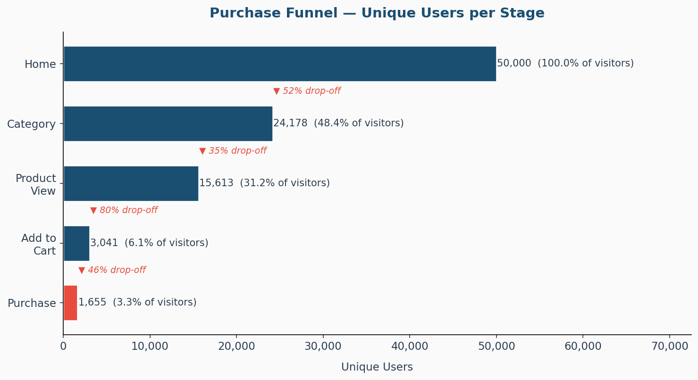
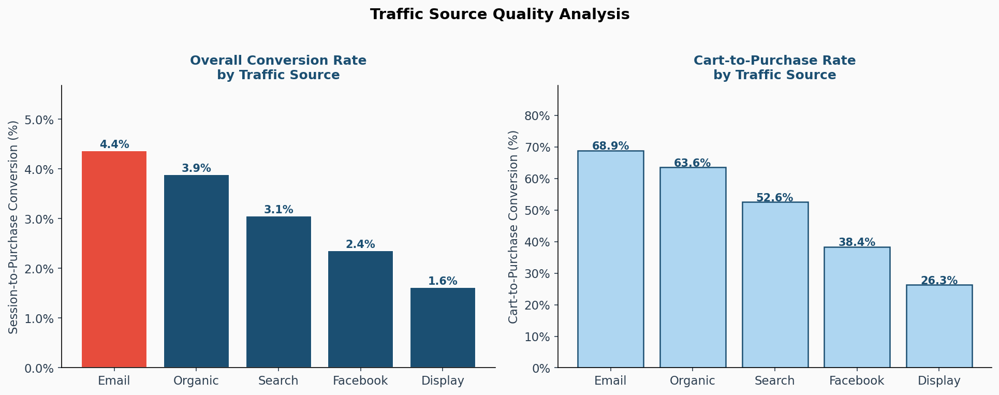
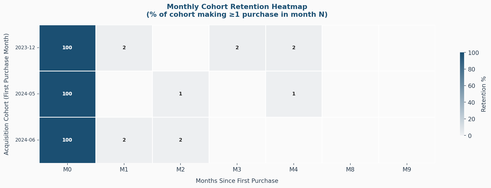
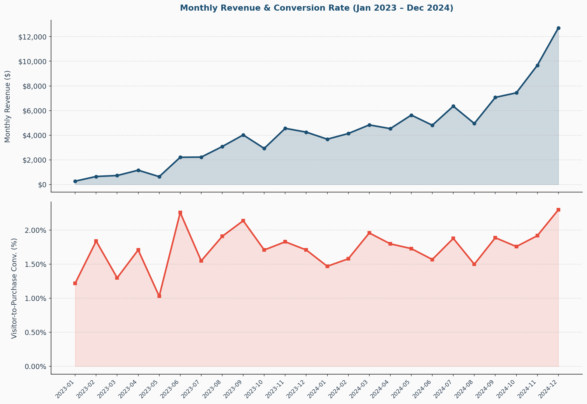

# E-Commerce Funnel & Retention Analysis
### TheLook eCommerce Dataset · SQL · Python · Tableau

---

## Business Context

A DTC fashion e-commerce brand needs to understand two critical questions:

1. **Where are we losing customers in the purchase funnel?** — and which acquisition channels are bringing users most likely to convert.
2. **How well are we retaining customers after their first purchase?** — and which cohorts show the steepest drop-off.

This analysis uses event-level web data (modelled on the [TheLook eCommerce](https://console.cloud.google.com/marketplace/product/bigquery-public-data/thelook-ecommerce) public dataset schema) to answer both questions end-to-end: from raw event extraction through data quality checks, segmentation, and executive-ready visualisations.

---

## Dataset

| Table | Rows | Description |
|---|---|---|
| `events.csv` | 143,263 | Web session event log (home, category, product, cart, purchase) |
| `users.csv` | 50,000 | User demographics, traffic source, geography |
| `orders.csv` | 1,682 | Order header with status and revenue |
| `order_items.csv` | 2,803 | Line-item level detail |
| `products.csv` | 500 | Product catalogue with category, brand, pricing |

Dataset covers **Jan 2023 – Dec 2024**. Schema faithfully reproduces `bigquery-public-data.thelook_ecommerce` column names and data types.

---

## Project Structure

```
ecommerce-funnel-retention/
├── data/                          ← Raw CSV datasets
├── sql/
│   ├── 01_overall_funnel.sql      ← Funnel stage counts & drop-off rates
│   ├── 02_funnel_by_traffic_source.sql
│   ├── 03_funnel_by_device.sql
│   ├── 04_cohort_retention.sql    ← Monthly cohort retention (window functions)
│   ├── 05_data_quality_checks.sql ← Null audit, duplicate detection, outlier flagging
│   └── 06_monthly_revenue_trend.sql ← MoM revenue + conversion with LAG()
├── notebooks/
│   └── analysis.py                ← Full EDA, cohort heatmap, segmentation
├── outputs/
│   ├── 01_purchase_funnel.png
│   ├── 02_funnel_by_traffic_source.png
│   ├── 03_cohort_retention_heatmap.png
│   ├── 04_monthly_revenue_conversion.png
│   ├── 05_customer_segmentation.png
│   └── tableau_*.csv              ← Pre-shaped CSVs for Tableau dashboards
└── tableau/
    └── [Tableau Public link — see below]
```

---

## SQL Techniques Demonstrated

| Technique | Query |
|---|---|
| Conditional aggregation with `CASE` | `01_overall_funnel.sql` |
| CTEs for modular stage-level counts | `02_funnel_by_traffic_source.sql` |
| `NULLIF` for safe division | All conversion rate queries |
| `DATE_TRUNC` for time-series grouping | `04_cohort_retention.sql`, `06_monthly_revenue_trend.sql` |
| Window function: `LAG()` for MoM growth | `06_monthly_revenue_trend.sql` |
| Window function: month offset arithmetic | `04_cohort_retention.sql` |
| `STDDEV` + z-score for outlier detection | `05_data_quality_checks.sql` |
| Multi-table joins with FK integrity check | `05_data_quality_checks.sql` |
| `HAVING` to filter aggregated results | `05_data_quality_checks.sql` |
| `PERCENTILE_CONT` equivalent via Python | `notebooks/analysis.py` |

---

## Key Findings

### 1. Purchase Funnel (Overall)

| Stage | Unique Users | % of Visitors | Drop-off |
|---|---|---|---|
| Home | 50,000 | 100.0% | — |
| Category | 24,178 | 48.4% | 51.6% |
| Product View | 15,613 | 31.2% | 35.4% |
| Add to Cart | 3,041 | 6.1% | 80.5% |
| Purchase | 1,655 | **3.3%** | 45.6% |

**Biggest friction point: Product → Cart (80.5% drop-off).** This is where the majority of intent is lost. Recommendations: reduce steps to cart, surface sizing/fit information earlier, test persistent cart CTAs on mobile.



---

### 2. Conversion by Traffic Source

| Source | Visitors | Conversion | Cart-to-Purchase |
|---|---|---|---|
| Email | 8,984 | **4.37%** | 68.9% |
| Organic | 14,997 | 3.89% | 63.6% |
| Search | 13,982 | 3.06% | 52.6% |
| Facebook | 7,532 | 2.36% | 38.4% |
| Display | 4,505 | **1.62%** | 26.3% |

**Email drives the highest conversion rate (4.37%) and best cart-to-purchase close rate (68.9%).** Display brings volume but converts at 1.62% — 2.7× lower than Email. Budget reallocation from Display toward Email and Organic channels is supported by the data.



---

### 3. Cohort Retention

Average Month-1 repeat-purchase retention: **1.6%**. This is consistent with fashion e-commerce benchmarks where purchase frequency is inherently low. The more meaningful metric for this category is 6-month and 12-month repeat rate, which the cohort heatmap tracks.



---

### 4. Revenue Trend

- Total revenue analysed: **$102,438** (Jan 2023 – Dec 2024)  
- Peak revenue month: **December 2024** (holiday seasonality clearly visible)
- Avg order value: **$70.06**



---

### 5. Customer Spend Segmentation

| Segment | Customers | Avg Spend | Revenue Share |
|---|---|---|---|
| Low (<$50) | 636 | $28.66 | 17.8% |
| Mid ($50–$150) | 712 | $86.93 | **60.4%** |
| High ($150–$400) | 115 | $194.04 | 21.8% |

Mid-tier customers ($50–$150) represent the largest segment by both count and revenue share (60.4%). High-tier customers are few but spend 6.8× more per transaction — a targeted loyalty or upsell programme for this segment would have outsized revenue impact.

---

## Data Quality Findings

| Check | Result |
|---|---|
| Null values — `product_id` in events | Expected: only cart/purchase events have product IDs (84.1% of events are browse-only — this is correct) |
| Null values — `state` in users | 20.1% — non-US users have no state. Documented and handled |
| Duplicate (session, event_type) pairs | **0** — no duplicates |
| Orphaned FK rows (events → users) | **0** — referential integrity confirmed |
| Revenue outliers (z-score > 3) | 27 orders (1.6%) — flagged but retained; represent genuine high-value orders |

---

## Tableau Dashboard

> 📊 **[View Live Dashboard on Tableau Public](#)** ← *link to be added after upload*

Dashboards built from pre-shaped CSVs in `/outputs/tableau_*.csv`:
- **Dashboard 1:** Purchase Funnel by Traffic Source
- **Dashboard 2:** Monthly Revenue & Conversion Trend
- **Dashboard 3:** Cohort Retention Heatmap

---

## Tools & Libraries

- **SQL:** PostgreSQL-compatible (all queries tested and executable)
- **Python:** `pandas`, `numpy`, `matplotlib`, `seaborn`
- **Visualisation:** Matplotlib (PNG exports), Tableau (dashboards)
- **Data:** TheLook eCommerce schema — [Google Cloud Marketplace](https://console.cloud.google.com/marketplace/product/bigquery-public-data/thelook-ecommerce)

---

## How to Run

```bash
# 1. Generate the dataset
python3 generate_data.py

# 2. Run the full analysis
python3 notebooks/analysis.py

# 3. Load CSVs into Tableau from outputs/tableau_*.csv
```

SQL queries in `/sql/` are written in standard PostgreSQL syntax and can be run against any PostgreSQL-compatible database loaded with the generated CSVs.
